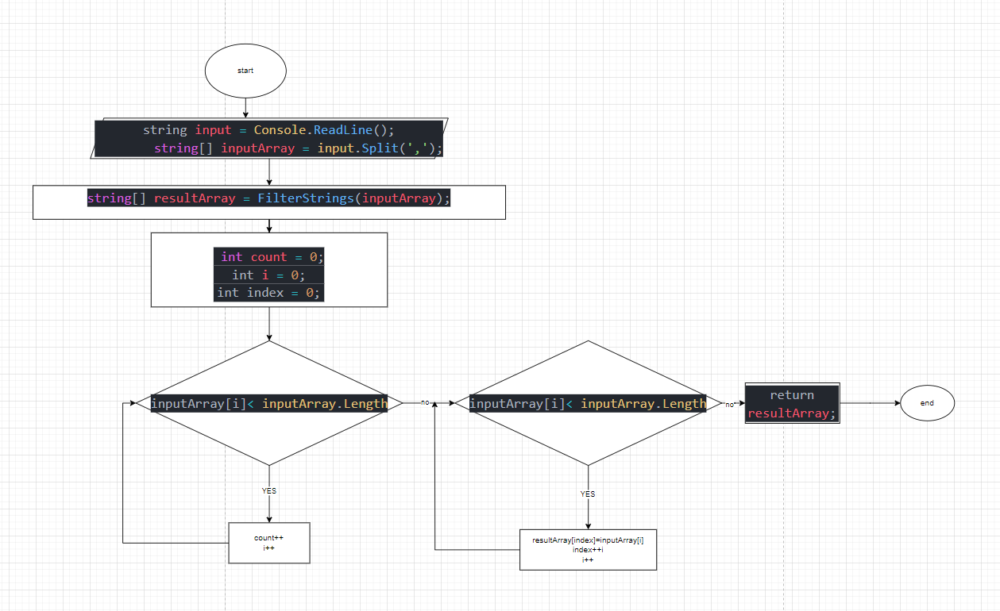

# Решение задачи

Сначала предлагаем юзеру ввести массив, разделенный запятой.
Эта строка разбивается на массив строк `input array` с использованием метода `Split(',')`

`Console.WriteLine("Введите массив:");
string input = Console.ReadLine();
string[] inputArray = input.Split(',');
`

Далее делаем функцию филтьтрации, которой передается введенный массив строк, а результат сохраняется в `resultArray`

`static string[] FilterStrings(string[] inputArray)`

Далее внутри функциии фильтрации фильтрируются строки, которые подходит под нашу длину(3символа). Сначала подсчитываются строки с помощью `count`, а затем создается `resultArray` размером `count`
После этого происходит второй проход по `inputArray` и каждая строка копируется в `resultArray`

И заканчиваем выводом результата с помощью `cw`

Блоксхема представлена в файле под названием *blok-shema.png* 

Также прикрепляю сюда 
